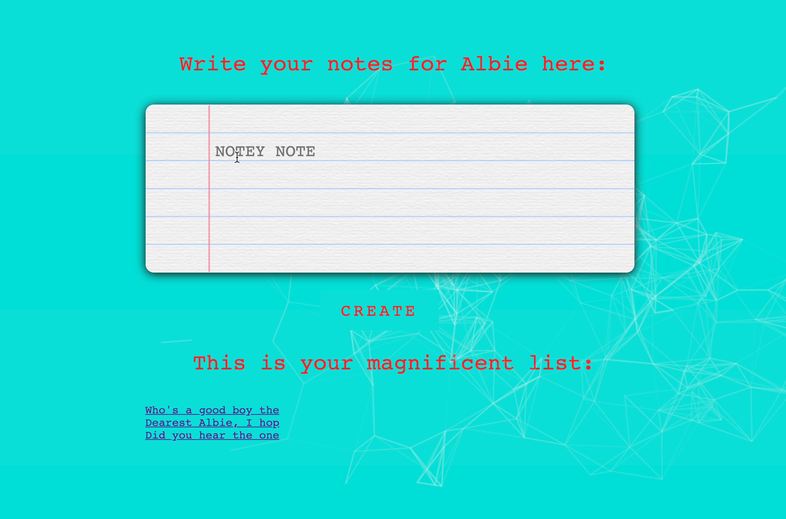
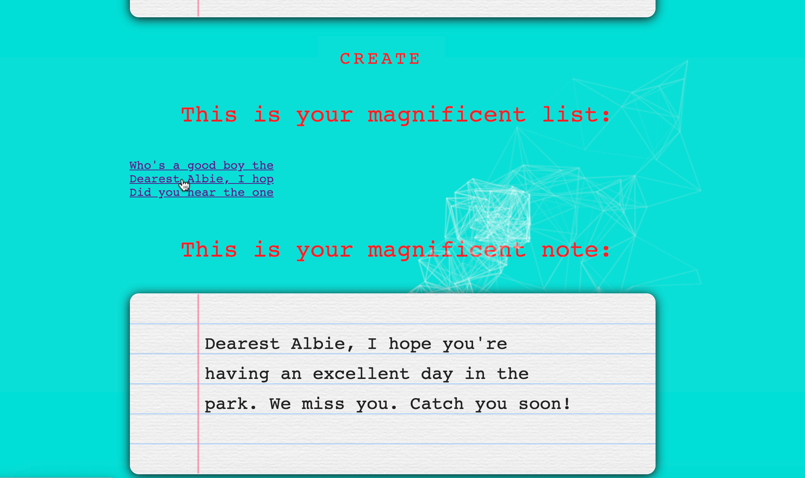
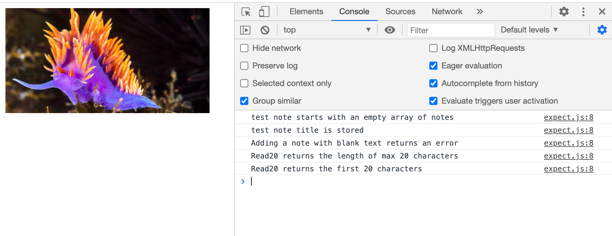

# Notes App

As part of week 7 at Makers, we have been challenged to create a Notes App. 

Our app is called Albie Notes, where you can leave notes for the dreamboat that is Albie the puppy. 

We created our own testing framework from scratch to better understand how existing frameworks like Jasmine and RSpec work.

It's called Nudi, after nudibranchs. They come in all shapes, colours and sizes under the same species. 

## How it works
### App
To run the app:
```
open index.html
```


Here you can see the app with a space to write your notes. 
Click `CREATE` when you're ready to add your note. 
A 16 character hyperlink will show up in the magnificent list. 


If you click on a link in the magnificent list, you'll see that magnificent note below.

### Tests

To run the tests on the Nudi testing framework:
```
open nudi/specRunner.html
Cmd + Option + J (on a mac)
OR
Right click + Inspect (opens the console on Chrome to see the test results)
```


You can see all 5 tests are passing in this screenshot.

## Technology used

Vanilla JavaScript was used for all the functionality of the app and testing framework. 

We used HTML and CSS to make the app look fancy, and added in a code snippet from codepen.io to give the mouse a tail of particle geometry wizardry.

Each time the app page is loaded the colourway is chosen at random from our 4 options.

